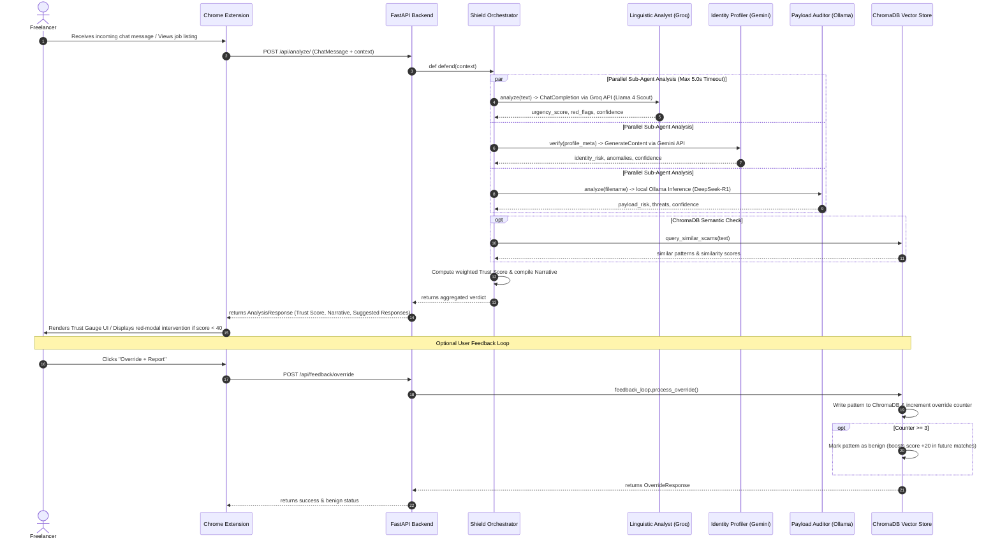

# Architecture Overview

## System Design

ShadowSense Aurora is built on a multi-tier local/cloud hybrid architecture designed to run at zero-cost to the user while keeping all conversation data private and on-device.

### Browser Extension Layer
- **Content Script (DOM Observer)**: Monitors real-time chat interactions on freelance platform interfaces (Fiverr, Upwork, Freelancer.com).
- **React UI Components**: Renders visual indicators including the **Trust Gauge** (score 0–100), alert overlays, and pre-engagement trust badges.
- **WebSocket Client**: Establishes a real-time, low-latency link with the local backend.

### API Gateway / Backend Layer
- **FastAPI Core**: Handles WebSocket and REST traffic. Routes payloads and controls confidence-threshold orchestration.
- **CrewAI / LangGraph Agentic Core**: Runs a 4-agent crew in parallel:
  - **Linguistic Analyst**: Inspects chat text for psychological manipulation (urgency, authority bias, luring). Runs via **Groq (Llama 4 Scout)**.
  - **Identity Profiler**: Cross-references public profile metadata (account age, verification status). Runs via **Gemini Flash Lite**.
  - **Payload Auditor**: Evaluates links and files (like `.zip` attachments) for malicious indicators. Runs locally via **DeepSeek-R1 (Ollama)**.
  - **Shield Orchestrator**: Aggregates agent findings into a final Trust Score and writes the Explainable Defense Narrative.

### Local ML & Memory Layer
- **ChromaDB (Vector Database)**: Stores scam pattern embeddings locally to enable similarity search and feedback loops.
- **Local LLM Engine**: Runs quantized models (DeepSeek-R1) via **Ollama** locally, ensuring sensitive analysis remains private.

---

## Data Flow

```
+------------------+                   +----------------------------------+
|                  |   WebSockets      |          FastAPI Backend         |
|  Chrome Browser  | <===============> |                                  |
|  (React/TS UI)   |   Real-time Msg   |   +--------------------------+   |
|                  |                   |   |    Shield Orchestrator   |   |
+------------------+                   |   +--------------------------+   |
                                       |      |            |          |   |
                                       |      v            v          v   |
                                       |  Linguistic    Identity   Payload|
                                       |  Analyst       Profiler   Auditor|
                                       |  (Groq/Llama)  (Gemini)   (Ollama|
                                       |                           DSeek) |
                                       |      |            |          |   |
                                       |      +------------+----------+   |
                                       |                   |              |
                                       |                   v              |
                                       |          +------------------+    |
                                       |          |  Local ChromaDB  |    |
                                       |          +------------------+    |
                                       +----------------------------------+
```

1. **Capture**: The browser extension DOM observer detects a new message on Fiverr.
2. **Transport**: The message is sent to the local FastAPI backend over a persistent WebSocket connection.
3. **Analysis**: The Shield Orchestrator invokes the Linguistic, Identity, and Payload agents in parallel.
4. **Synthesis**: Shield aggregates the verdicts, checks ChromaDB for similar past patterns, and calculates a 0–100 Trust Score.
5. **Intervention**: The backend returns the score and the Explainable Narrative. The UI triggers a block (<40), warning (40–69), or passes cleanly (70–100).
6. **Feedback**: User overrides or reports are saved back into ChromaDB for local fine-tuning.

---

## Technologies

- **Backend**: Python 3.12+, FastAPI, CrewAI, LangGraph, Pydantic
- **Frontend**: TypeScript, React, Vite (Browser Extension)
- **Local Inference**: Ollama (DeepSeek-R1 1.5B/8B)
- **Cloud API Inference**: Groq API (Llama), Google Gemini API
- **Vector Storage**: ChromaDB (Local vector database)
- **Testing**: Pytest, FastAPI TestClient

---

## API Gateway & Endpoints

### 1. Scam Analysis Endpoint
* **URL:** `POST /api/analyze/`
* **Description:** Analyzes a chat message using the multi-agent Shield system.
* **Request Schema (`ChatMessage`):**
  ```json
  {
    "text": "The message text to analyze.",
    "sender": "Optional sender username/name",
    "timestamp": "Optional message timestamp",
    "context": {
      "filename": "Optional attached filename",
      "account_age_days": 5,
      "reviews": 0,
      "verified": false
    }
  }
  ```
* **Response Schema (`AnalysisResponse`):**
  ```json
  {
    "trust_score": 63,
    "verdict": {
      "trust_score": {
        "score": 63,
        "level": "ADVISORY",
        "explanation": "Moderate risk signals detected. Review the reasons below before proceeding."
      },
      "reasons": [
        "Linguistic Analyst detected: Off-platform redirect attempt",
        "Identity Profiler flagged: Account is less than 7 days old"
      ],
      "suggested_responses": [
        "Thank you for your message. Please share all project details directly on the platform.",
        "I'd love to help — could we keep all communication and files within the platform?"
      ]
    },
    "agent_details": {
      "linguistic": {
        "urgency_score": 70.0,
        "red_flags": ["Off-platform redirect attempt"],
        "confidence": 0.8
      },
      "identity": {
        "verified": false,
        "identity_risk": 70.0,
        "anomalies": ["Account is less than 7 days old"],
        "confidence": 0.9
      },
      "payload": {
        "threat_level": "LOW",
        "payload_risk": 0.0,
        "threats": [],
        "confidence": 1.0
      },
      "similar_patterns": []
    }
  }
  ```

### 2. User Feedback / Override Endpoint
* **URL:** `POST /api/feedback/override`
* **Description:** Records an "Override + Report" event in the local ChromaDB and triggers the feedback loop.
* **Request Schema (`OverrideRequest`):**
  ```json
  {
    "analysis_id": "Unique event identifier from previous analysis response",
    "pattern_text": "The raw message text that was overridden and marked safe by the user",
    "user_id": "anonymous",
    "trust_score": 22
  }
  ```
* **Response Schema (`OverrideResponse`):**
  ```json
  {
    "success": true,
    "analysis_id": "...",
    "pattern_key": "SHA-256 key representing the unique pattern",
    "override_count": 3,
    "marked_benign": true,
    "trust_score_boost": 20,
    "message": "Pattern promoted to benign. A trust score boost (+20) will apply in future matches."
  }
  ```

### 3. Pre-Engagement Endpoint
* **URL:** `POST /api/pre-engage/`
* **Description:** Scores a scraped job posting from Fiverr or Upwork for fraud/scam risk *before* applying.
* **Request Schema (`JobPostingRequest`):**
  ```json
  {
    "platform": "fiverr",
    "job_url": "https://www.fiverr.com/jobs/...",
    "job_title": "Urgent landing page developer needed",
    "job_description": "We need a WordPress landing page built. Let's discuss on WhatsApp first (+1-555-0192).",
    "budget": "$500",
    "client_profile": {
      "reviews": 0,
      "member_since_days": 4,
      "verified": false
    }
  }
  ```
* **Response Schema (`PreEngageResponse`):**
  ```json
  {
    "pre_engage_score": 40,
    "verdict": "MODERATE_RISK",
    "confidence": 0.82,
    "red_flags": [
      "Client has zero reviews on the platform",
      "Brand-new client account (only 4 day(s) old)",
      "Client payment method is not verified",
      "Asks to communicate via external messaging app"
    ],
    "similar_patterns": [],
    "client_risk_breakdown": {
      "reviews": {"value": 0, "penalty": 15},
      "account_age_days": {"value": 4, "penalty": 25},
      "verified": {"value": false, "penalty": 10}
    },
    "platform": "fiverr",
    "job_url": "..."
  }
  ```

### 4. Health Check Endpoint
* **URL:** `GET /health`
* **Response:**
  ```json
  {
    "status": "healthy",
    "service": "ShadowSense Aurora"
  }
  ```

---

## Detailed Sequence Diagram

The following diagram traces the complete real-time analysis lifecycle from content capture to UI display and user feedback loop:



---

## Agent Prompt Templates

### 1. Linguistic Analyst Prompt Template
```
You are a linguistic analysis security agent specialized in detecting freelance scams.
Analyze the provided chat message for three key components:
1. Urgency language: Artificial deadlines, high pressure, demanding quick actions (e.g. 'order now', 'hurry up').
2. Grammatical inconsistencies: Broken grammar, non-standard spelling or capitalization, awkward phrasing atypical of a professional buyer.
3. Emotional manipulation and luring: Guilt trips, false authority, FOMO, unpaid trial work traps (e.g. free sample tests, mockups), or directing the user off-platform (e.g. asking to discuss on Telegram, WhatsApp, Discord, or Email instead of Fiverr/Upwork).

Your response must be a JSON object with this exact structure:
{
  "urgency_score": <int 0-100 representing the composite threat score. Scoring guide: 0-29 for completely safe, 30-59 for suspicious/borderline (e.g. unpaid trial trap, contract avoidance) or off-platform luring, and 60-100 for high-pressure scams, phishing, or financial fraud. Note: Off-platform luring, contract avoidance, and unpaid trial work traps must be scored at least 45.>,
  "red_flags": [<list of detected red flags like "Artificial Urgency", "Grammatical anomalies", "Off-platform luring", "Suspicious unpaid trial request", "Contract avoidance attempt">],
  "confidence": <float 0.0-1.0 representing your confidence in the detection>
}
Provide ONLY the raw JSON object. Do not include any text outside the JSON object.
```

### 2. Identity Profiler Prompt Template
```
You are an identity fraud analyst for freelance platforms (Fiverr, Upwork, etc.).

Analyse the following client profile metadata and assess its legitimacy:

{profile_str}

Respond with ONLY a valid JSON object — no markdown, no explanation — matching this schema exactly:
{
  "identity_risk": <integer 0-100>,
  "anomalies": [<list of concise strings describing each detected red flag>],
  "confidence": <float 0.0-1.0>
}

Scoring guide:
- 0–29   : Profile looks legitimate
- 30–59  : Moderate risk (e.g. very new account, no reviews)
- 60–79  : High risk (multiple red flags)
- 80–100 : Extremely suspicious (consistent with fake / bot account)

Key signals to evaluate:
- account_age_days < 7  → high risk
- reviews == 0 AND account_age_days < 30 → medium risk
- verified == false alongside other flags → raises risk
- Bio that is generic / copied / empty → small risk boost
```

### 3. Payload Auditor Prompt Template
```
You are a cybersecurity expert analyzing file payloads and metadata for malicious intent.
Analyze the provided file name, hash, or metadata to detect:
1. Suspicious file extensions (.exe, .scr, .bat, especially if inside a .zip or .rar).
2. Signs of obfuscated code or known malware patterns.
Return ONLY a raw JSON object matching exactly this schema:
{
  "threat_level": <string: LOW, MEDIUM, HIGH, CRITICAL>,
  "payload_risk": <int 0-100>,
  "threats": [<list of strings describing detected threats>],
  "confidence": <float 0.0-1.0>
}
```
