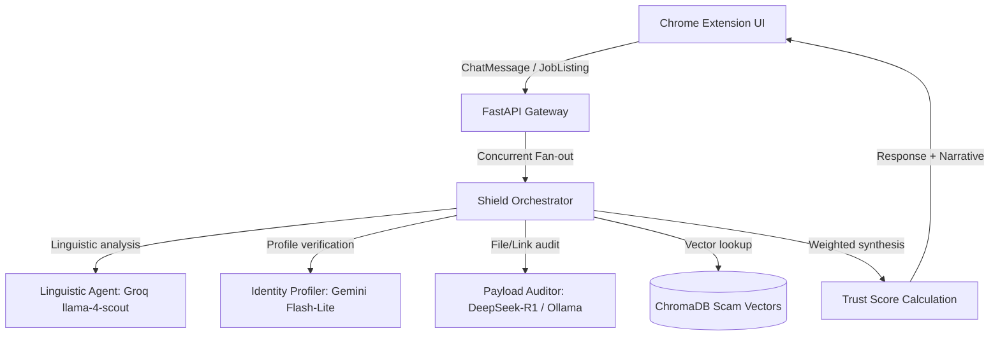

# ShadowSense Aurora 2026: AI-Powered Freelance Security Shield
*Pitch Deck — Team Aurora*

---

## Slide 1: Executive Summary & Title
### **ShadowSense Aurora 2026**
*Real-Time, Multi-Agent AI Shield Protecting the Global Freelance Economy*

* **The Mission:** To secure the future of remote work by shielding freelancers from sophisticated client fraud, off-platform financial traps, and malicious payloads directly inside their daily communication workflows.
* **The Product:** A lightweight, non-intrusive browser extension powered by a secure FastAPI backend running a multi-agent orchestration pipeline.
* **Core Value Prop:** Redefines freelancer security from passive, reactive reports to proactive, real-time blocking of scam attempts before any financial or technical damage is done.

---

## Slide 2: The Problem: Freelancer Fraud & Scam Tactics
### **The Growing Danger on Upwork, Fiverr, and Beyond**
Freelancers face an unprecedented surge in targeted scams. Platform support alone cannot keep up with high-volume, rapid evasions:
* **Off-Platform Lures:** Scammers lure freelancers off-platform (WhatsApp, Telegram) to bypass security filters and conduct payment fraud.
* **Identity Profiling Fraud:** Fake buyer profiles with 0 reviews and unverified payments impersonating reputable entities.
* **Payload Attacks:** Delivery of Remote Access Trojans (RATs), keyloggers, and malware disguised as "project briefs" or "client portal viewers" (.zip, password-protected archives).
* **Financial Extortion:** Unpaid "test tasks," check-overpayment scams, and cryptocurrency deployment gas-fee extortion.

---

## Slide 3: The Solution: ShadowSense Aurora Real-Time Shield
### **Proactive, Real-Time Workspace Defense**
ShadowSense Aurora integrates directly into the freelancer's workspace as a native web extension:
* **Passive Monitoring:** Observes chat and listing elements securely without disrupting the freelancer's focus.
* **Trust Gauge UI:** Displays a real-time color-coded trust score (0–100) reflecting the threat level.
* **Automated Intervention:** Soft advisory warnings for moderate risk, and hard blocks (disabling chat inputs) for high-risk threats to prevent communication progression.
* **Defense Narrative:** Provides transparent, explainable bullet points detailing *why* a conversation is flagged, plus template responses to handle the buyer safely.

---

## Slide 4: Market Opportunity & Target Audience
### **Securing a Multi-Billion Dollar Workforce**
* **Market Size:** The freelance economy comprises over 70 million active professionals globally, contributing billions of dollars to platforms like Fiverr, Upwork, and Freelancer.com.
* **Loss Volume:** Estimated annual losses due to freelancer scams, credential theft, and work exploitation exceed $150M.
* **The Gap:** Current security tools focus on enterprise email/networks; no dedicated, low-friction solution exists tailored to the exact communication patterns of contract freelancers.
* **ShadowSense Edge:** Zero configuration, platform-agnostic detection running directly inside freelance communication portals.

---

## Slide 5: Multi-Agent AI Architecture
### **The Orchestration Pipeline**
ShadowSense Aurora's backend uses a coordinated multi-agent system (powered by CrewAI) for low-latency, high-accuracy risk analysis:

---

## Slide 6: Agent Deep-Dive: Linguistic Analyst
### **Semantic and Psychological Threat Profiling**
* **Engine:** Powered by Groq / `llama-4-scout` (custom-prompted security model).
* **Capabilities:** Analyzes conversational context for social engineering triggers, coercive deadline pressure, platform-bypass requests, and grammatical markers typical of organized scam operations.
* **Key Metrics:** Urgency pressure scores, grammatical deviation indicators, and confidence ratings.
* **Linguistic Penalty:** Translates suspicious semantic structures directly into a weighted linguistic risk contribution (max 45 points of total risk).

---

## Slide 7: Agent Deep-Dive: Identity Profiler
### **Metadata and Verification Auditing**
* **Engine:** Powered by Gemini Flash-Lite for fast JSON-structured profile verification.
* **Capabilities:** Evaluates scraped buyer profile metadata (account age, rating, review history, verification status, and country profile).
* **Heuristics:** Flags account age anomalies (e.g. account created <7 days ago), zero review history coupled with high-value contracts, and missing payment verification.
* **Identity Risk Weight:** Contributes up to 35% of the total risk calculation, protecting freelancers from fly-by-night accounts.

---

## Slide 8: Agent Deep-Dive: Payload Auditor
### **File and Hyperlink Threat Detection**
* **Engine:** DeepSeek-R1 running locally via Ollama.
* **Capabilities:** Audits files and URLs exchanged in the chat thread.
* **Scrutiny Targets:**
  * Executable archives (.exe, .scr, .bat, .vbs) disguised as document templates.
  * Password-protected archives (.zip, .rar) designed to bypass platform virus scanners.
  * Typosquatted links or shortened URLs (e.g. bit.ly, tinyurl) mimicking platform login portals.
* **Payload Risk Weight:** Accounts for 20% of the risk score, acting as the final buffer against malware execution.

---

## Slide 9: ChromaDB & Adaptive Feedback Loop
### **Continuous Learning via Vector Databases**
* **Local Scam Repository:** Leverages ChromaDB vector stores to index historical scam templates.
* **Semantic Similarity Check:** Runs sentence-transformer embeddings against current text. If a message is a >=0.55 similarity match to a known scam, it triggers up to a **12-point trust score penalty**.
* **Benign-Pattern Override:** Freelancers can override incorrect blockings by marking false positives. 
* **Collective Trust Boost:** If 3+ users override a specific pattern, the feedback loop registers it as a benign template, automatically granting a **+20 trust-score boost** on future queries.

---

## Slide 10: Performance, Latency, and Scalability
### **Enterprise-Grade Responsiveness**
Freelance security requires instant feedback. ShadowSense Aurora is optimized for real-time operation:
* **Concurrent Execution:** Linguistic, Identity, and Payload agents execute in parallel using Python's thread-pool executor.
* **Target Latency:** Average end-to-end API response time under **2.5 seconds** (target < 3.0s).
* **Caching:** In-memory caching for frequently queried buyer profiles and similarity lookups.
* **Fail-Safe Fallbacks:** Graces back to stub results or partial calculations if individual LLM endpoints timeout, ensuring the browser UI never freezes.

---

## Slide 11: Privacy-First & Green AI
### **Sustainable and Secure Architecture**
* **Llama-Guard Privacy:** Auto-redacts Personal Identifiable Information (PII) like names, email domains, phone numbers, and API keys before forwarding text to LLM providers.
* **Local Processing:** Heavy vector embedding calculations and database lookups run entirely inside the local backend server, reducing network hops and cloud dependencies.
* **Energy-Efficient Token Management:** Limits system prompt sizing and context length to enforce low-energy usage per LLM inference, minimizing the system's carbon footprint.

---

## Slide 12: Future Roadmap & Team
### **Expanding the Perimeter of Freelance Defense**
* **Phase 1 (Q3 2026):** Aurora 2026 Portal Submission and public beta testing with 5,000 active freelancers.
* **Phase 2 (Q4 2026):** Direct browser store deployment, supporting Google Chrome, Brave, and Microsoft Edge.
* **Phase 3 (Q1 2027):** Real-time automated file scanning (sandboxed dynamic execution of attachments) and multi-language support (Spanish, French, Urdu).
* **Team:**
  * Member 1: AI Backend & Core Agent Orchestrator
  * Member 2: Extension UI Lead & Content Scripts Engineer
  * Member 3: ML Pipeline, Caching & Vector Store Specialist
  * Member 4: Product Manager, Integration Testing & Technical Writer
